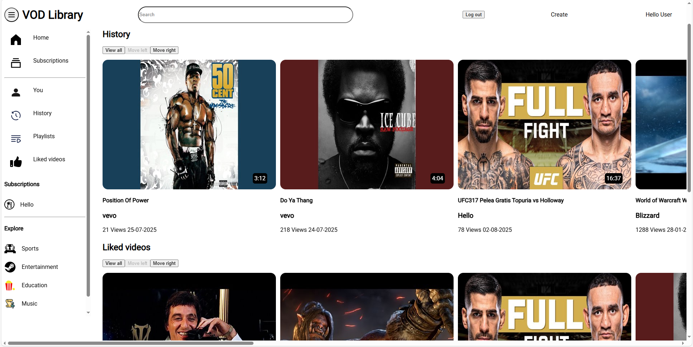
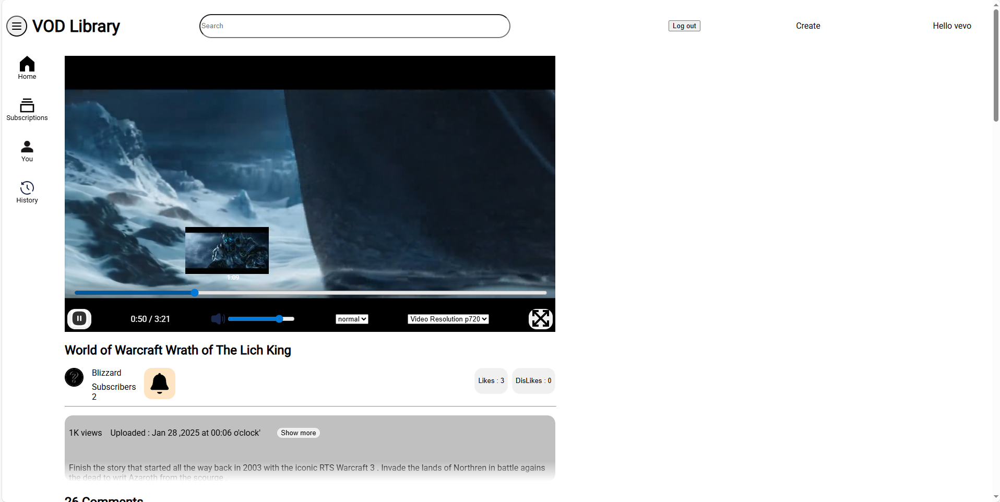
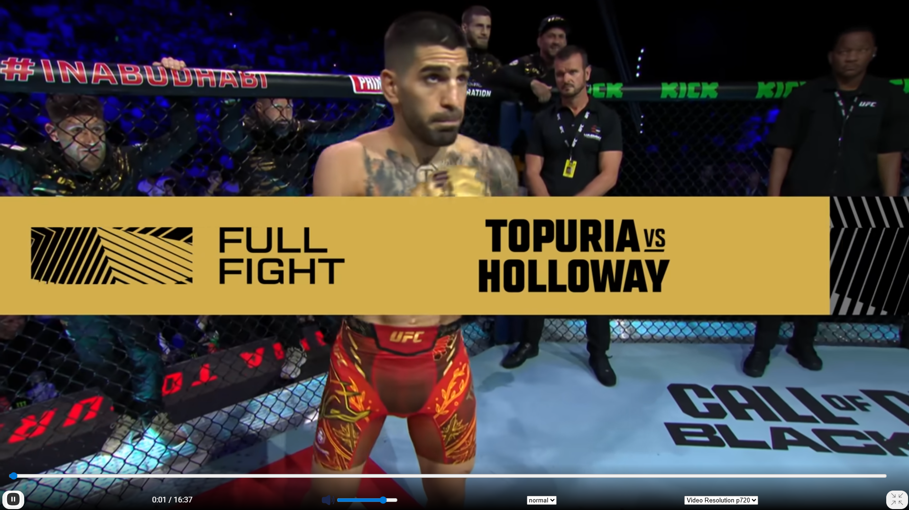
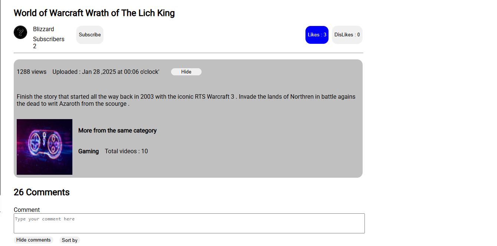
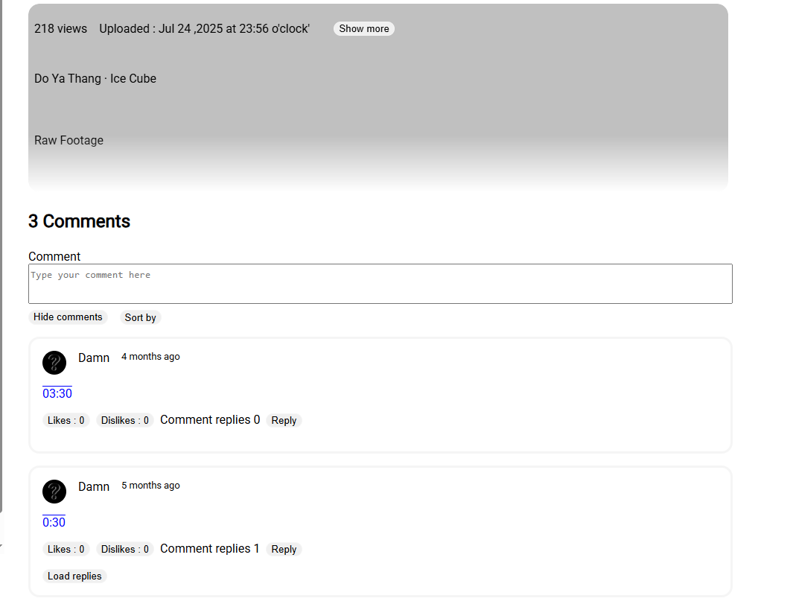

Below is a short visual walkthrough of the core user experience.
Screenshots are taken from a locally running instance.

Main menu of the application and all the categories.
Each video card contains the video thumbnail, length of it , upload date , title , uploader and views

------------------------------------------------------

On the left side of the UI we have additinal options which route to different sections of the website
examples like collection of liked videos and histroy of watched content all depending of wether the user has logged in or not

Video Player
the video player length bar moves according to the time span of the video , resolution changeing supports to max 720p and min 360p. As well as an option to change the vdieo speed 
from 0.25x to 2.0x

Full Screen selected

Under the video element are the description of the video , like and dislike buttons , views, category name and the count of how many videos exist with this category

Writing a timestamp is clickable and directly forwards to that section of the video

